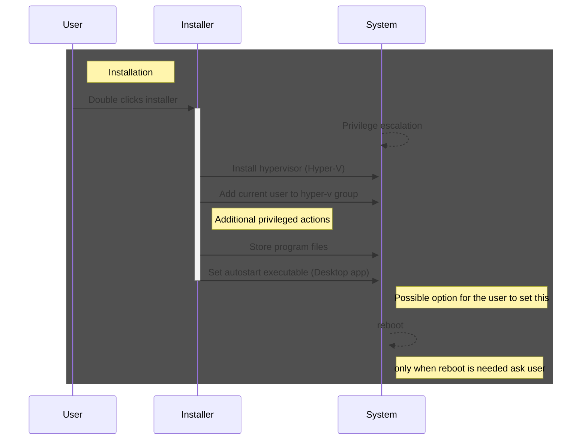

# Diagrams

```mermaid
sequenceDiagram
    rect rgb(80, 80, 80)
        note right of User: Installation
        User->>+Installer: Double clicks installer
        System-->>System: Privilege escalation
        Installer->>+System: Install hypervisor (Hyper-V)
        Installer->>+System: Add current user to hyper-v group
        note right of Installer: Additional privileged actions
        Installer->>+System: Store program files
        Installer->>-System: Set autostart executable (Desktop app)
        note right of System: Possible option for the user to set this
        System-->>System: reboot
        note right of System: only when reboot is needed ask user
    end
```
